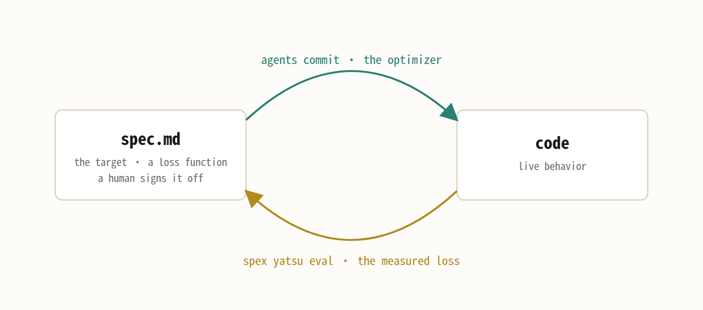

<div align="center">


<p>
  <a href="https://www.npmjs.com/package/spexcode"></a>
  
  
  <a href="https://spexcode.net"></a>
</p>

<p>
  
  
  
  
</p>

</div>

Spec-driven orchestration for your coding agents. SpexCode keeps a versioned tree of specs inside
your git repo, links every spec to the code it governs, and runs a session manager that dispatches
coding agents into isolated worktrees.

English | [中文](./docs/README.zh-CN.md) · Docs: [spexcode.net](https://spexcode.net) · License: MIT

==here display a table that has two columns, the first column is the name of the features, the second is the description for them.==
==feature list(you should expand them properly): computable spec-code drifting mechanism, sessions/worktrees management(layered supervision structure), full shareable url (spec nodes, evals, sessions...), modularized(suitable, customizable as building bricks for your own software factory), cross-harnesses support==

## The model

use a graph here to describe the spec-code relationship clearly (and the function tracking, a little explanation of the algorithm used here), raw spec vs expanded spec etc.

then a graph to describe the situation when the spec go stale

## a heuristic learning perspective for softwares

Specs, commits, and evals compose into one loop. The spec is the loss function: it states what you
want. Commits are the optimizer. **eval**, the measurement
subsystem, scores how far live behavior currently sits from the spec.

 ==adjust this image to be smaller in size==

When vibe coding, you don't look at the details like reads a neural net by staring at its weights. Attention goes to the spec and the evals; the begins and the ends.

## Quick start

==this part might need update, or perhaps explain the materialize mechanism==

Requires Node ≥ 22 and git. This part is plain tooling — no AI involved yet.

```sh
npm i -g spexcode                              # installs the `spex` command
cd your-repo
spex init --harness claude,codex,opencode,pi,claude-headless,opencode-headless,pi-headless,codex-headless   # seeds .spec/, installs hooks, materializes the agent contracts
```
==see and actually test if this command sequence needs any update==

That's the whole adoption. The example lists all the built-in harnesses — remove the ones you don't
use: `--harness` is required, has no default, and takes any one id or comma-separated subset.
`spex init` is additive: it works on any existing git repo and never
overwrites your files — it creates a root `.spec/project/spec.md` and a starter `spexcode.json`,
installs the git hooks, and writes the selected harness's managed contract, so any agent working in
the repo discovers the workflow on its own.

When you want the live board — the graph, sessions, evals — start the runtime:

```sh
spex serve       # this project's backend — prints its URL, registers itself for your user
spex dashboard   # once per user, any directory: the one dashboard — open the URL it prints
```

## How does this system work

==now explain our L0, L1, L2 structure with a polished graph here==

## Working with agents (L1)

==use terminal recording tools here to show the spex session ls result or some other beautiful demonstrations, a dynamic gif is required)==

This part needs tmux on the machine. You should use wls2 on Windows machine.

```sh
spex session new "[[settings]] make the settings page remember the last tab"
```

==an image similar to this, has both English and Chinese version, but more polished for readme usecase==


You supervise on the dashboard, or with the same commands your agent uses:

==check if these commands still work! and one problem, the name `settings` might be too "keyword-like", might change it to use a different example to avoid confusion==
```sh
spex session watch              # stream session transitions: launched / review / done / needs-input ...
spex session review settings    # commits ahead of trunk, merge-base diff, merge-conflict/lint gates
spex session merge settings     # gated merge into the trunk
spex session close settings
```

Independent tasks run in parallel. Each worker is isolated in its own worktree, git serializes the
merges, and a pre-commit guard blocks direct commits on the trunk, so everything flows through
reviewable node branches.

The process is enforced by mechanism, not prompt engineering: the backend creates the branch and a
hook stamps the attribution; the materialized ==contract block(what is contract block?? a strange name, should use more plain words)== carries the rest, so your dispatch prompt stays task-only. More on this mode of working:
[working with agents](https://spexcode.net/working-with-agents/). ==this documentation website might also go stale now, check it and update it==

==please remove the eval,linter and configuration part completely, wayyy too verbose==

## Dashboard functionality (L2)

(features come along with their screenshots)

spec map of your whole repo, agent avatar displaying on the map when edits are applying, dedicated eval page for a session for easy review

realtime supervision of your agent status

runs on web, so any part of the system is a trackable url and can share with your colleagues, you can even use the same session board together
can copy tmux command and open in your terminal, etc.

## Contributing

[`docs/CONTRIBUTING.md`](docs/CONTRIBUTING.md) gets you from a clone to a first merged change.
[spexcode.net](https://spexcode.net) has the full mechanics of the node model and the
reflexive plugin system.

## Credit

First introduced on the [LINUX DO](https://linux.do) community — thanks to everyone there for the first round of discussion.

## License

[MIT](./LICENSE).
