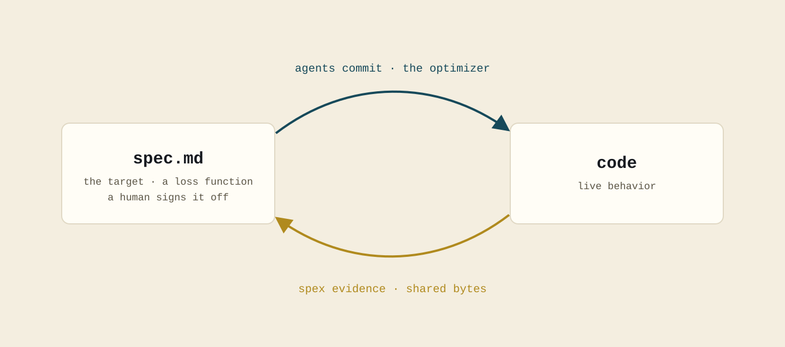
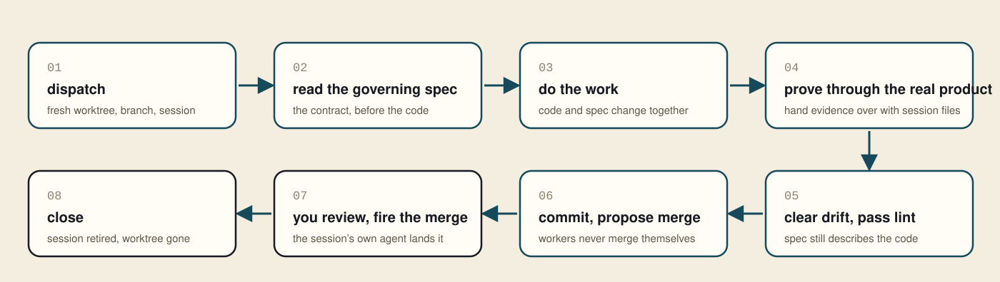

<div align="center">


<p>
  <a href="https://www.npmjs.com/package/spexcode"></a>
  
  
  <a href="https://spexcode.net"></a>
</p>

<p>
  
  
  
  
</p>

</div>

Spec-driven orchestration for your coding agents. SpexCode keeps a versioned tree of specs inside
your git repo, links every spec to the code it governs, and runs a session manager that dispatches
coding agents into isolated worktrees. You review and merge; the tool keeps intent and
implementation from drifting apart.

English | [中文](./docs/README.zh-CN.md) · Docs: [spexcode.net](https://spexcode.net) · License: MIT

| Feature | Description |
|---|---|
| **Computable spec–code drift** | Every spec pins the file it governs, down to the function. Whether code moved without its spec is computed from commits and line ranges, the same way on every machine: advisory for the file, blocking when an anchored function changes. |
| **Session & worktree management** | Each task dispatches into its own worktree and branch under one supervision state machine: `working → review → merged`. Workers propose; you review once, at merge time. Independent tasks run in parallel. |
| **Shareable URLs** | Spec nodes, sessions, evals, live terminals: every dashboard view has a stable address you can send to a colleague. Two people can watch the same session board. |
| **Modular layers** | Three separable layers: the spec↔code data asset (L0), the session substrate (L1), the dashboard (L2). Take what you need; the lower layers are building bricks for your own software factory. |
| **Cross-harness support** | Claude Code, Codex, OpenCode, pi, each interactive or headless. One materialized workflow contract serves them all; adding a harness is a config entry. |

## The model

A spec node is a directory under `.spec/` holding a `spec.md`: frontmatter naming the one file it
governs (`code:` — optionally pinned to specific functions with `path#symbol`) and the files it
references (`related:`), then a prose body stating what that part of the system is supposed to do,
right now. Nodes nest, so the tree mirrors how you think about the project rather than the file
layout. The body can split into two labelled parts: a short **raw source** a human signs off on, and
an **expanded spec** the agent iterates freely — as long as it keeps matching the raw source.


Git is the only database: a node's versions are the commits that touched its
`spec.md`. A change is one commit that updates both the spec and the code it justifies. When code
moves alone, the linter notices:


The check compares plain git facts: which commits came after the spec's last version, and whether
they intersect the anchored unit's lines. It cannot judge whether the new behavior is better, only
that the spec stopped describing it. The commit in the diagram updated seven other specs in the
same rename and missed this one; that kind of miss is normal work, and it is what a mechanical
check catches.

## Software as a learning loop

Specs, commits, and evals compose into one optimization loop. The spec is the loss function: it
states what you want, and it is the half a human signs off on. Commits are the optimizer. **eval**,
the measurement subsystem, scores how far live behavior currently sits from the spec — an agent runs
each scenario against the product's real surface, the way an end user would touch it, and files the
result with evidence (a screenshot, a recording). The score's history lives in git like everything
else, and a bug fix is expected to bracket: a failing eval that reproduces the bug, then a passing
one on the same scenario.

<div align="center"></div>

Nobody reads a neural net by staring at its weights, and between merge gates you don't stare at
agent diffs either. Attention goes to the two ends — the spec and the evals; the diff gets read
once, at merge time.

## Quick start

Requires Node ≥ 22 and git. No agent is involved in this part yet.

```sh
npm i -g spexcode                              # installs the `spex` command
cd your-repo
spex init --harness claude,codex,opencode,pi,claude-headless,opencode-headless,pi-headless,codex-headless   # seeds .spec/, installs hooks, materializes the agent contracts
```

That's the whole adoption. The example lists all the built-in harnesses; remove the ones you don't
use (`--harness` is required and takes any one id or comma-separated subset).
`spex init` is additive: it works on any existing git repo, never overwrites your files, and does
three things. It seeds a root `.spec/project/spec.md` plus a starter `spexcode.json`, installs the
git hooks, and **materializes** the workflow rules into the files your agent already reads
(`CLAUDE.md`, `AGENTS.md`): read the governing spec before the code, land spec and code in one
commit, propose merges instead of performing them. Any agent that opens the repo discovers the
workflow on its own.

When you want the live board (the graph, sessions, evals), start the runtime:

```sh
spex serve       # this project's backend — prints its URL
spex dashboard   # the machine's one gateway — every project behind one URL
```

One `spex dashboard` per machine is enough: every project you serve shows up behind it, and its
`/projects` page manages them from the browser.
[Getting started](https://spexcode.net/getting-started/) walks the rest of the setup.

## How it's put together

Three stacked layers, and each is worth having without the ones above it:


L0 is the asset an organisation adopts and keeps: plain files in plain git, useful offline.
([Watch this repo's own L0 grow from its git
history](https://spexcode.net/assets/spec-tree-growth.mp4), 160 spec nodes over three weeks.)
L1 puts agents to work on that asset: the session state machine below. L2 is the workspace you
watch it all from, and because it is only a consumer of L1, anything the dashboard does, your
scripts and agents can do through the same CLI.

## Working with agents (L1)

This part needs tmux and a logged-in [Claude Code](https://www.anthropic.com/claude-code) or Codex
on the machine (on Windows, run inside WSL2).

```sh
spex session new "[[uploader]] retry failed chunks with backoff"
```

launches a worker session in its own worktree on branch `node/uploader-…`. The prompt's first
`[[uploader]]` mention sets the branch name and board attribution; the worker finds and reads
the governing spec before touching code. It makes the change, rewrites the spec body to
match, commits both, then proposes a merge and stops:



Workers never merge themselves. The merge stays with you, and when you fire it, the session's own
agent runs the actual `git merge`, so conflicts land on the one who knows the work. The same
dispatch is a button on the dashboard; the command form is what agents themselves use when they
delegate. You supervise from either side:

```sh
spex session ls                  # the living table below
spex session watch stream        # follow transitions: working → review → done …
spex session review uploader     # commits ahead of trunk, merge-base diff, merge/lint gates
spex session merge uploader      # hands the gated merge to the session's own agent
spex session close uploader      # retire the worktree, branch, and record
```


The process is enforced by mechanism: the backend creates the branch, a git
hook stamps the attribution, a pre-commit guard blocks direct commits on the trunk, and the
materialized workflow rules in `CLAUDE.md`/`AGENTS.md` carry the rest, so your dispatch prompt
stays task-only. More on this mode of working:
[working with agents](https://spexcode.net/working-with-agents/).

## The dashboard (L2)

Everything above has a live view. Start `spex serve` and `spex dashboard`, then:


*Your whole repo as one map — SpexCode's own board shown. Each node carries its version and eval
state, an agent's avatar hovers on the node it is editing right now, and the rail top-left is the
live session console.*


*Click a node: the raw source on top, the expanded spec below it, the file it governs, its current
drift state, and tabs for the version history git already kept, its issues, and its evals.*


*An eval reading under review: the verdict, the scenario's expected result, the agent's note and
recorded video evidence. You annotate right on it, and the review queue on the right walks you to
the next one.*

The whole workspace is served over HTTP, so every view (a spec node, a session, an eval reading, a
live terminal) is a stable URL you can hand to a colleague; you can sit on the same board together.
The terminal pane is a real tmux session: copy the printed command and attach from your own
terminal.

## Contributing

[`docs/CONTRIBUTING.md`](docs/CONTRIBUTING.md) gets you from a clone to a first merged change.
[spexcode.net](https://spexcode.net) has the full mechanics of the node model and the
reflexive plugin system.

## Credit

First introduced on the [LINUX DO](https://linux.do) community — thanks to everyone there for the first round of discussion.

## License

[MIT](./LICENSE).
