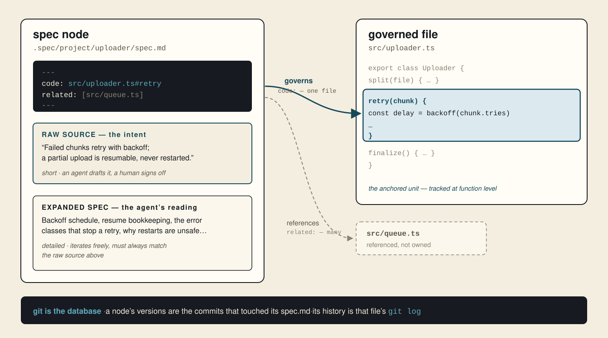
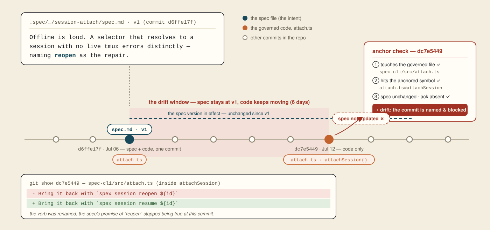
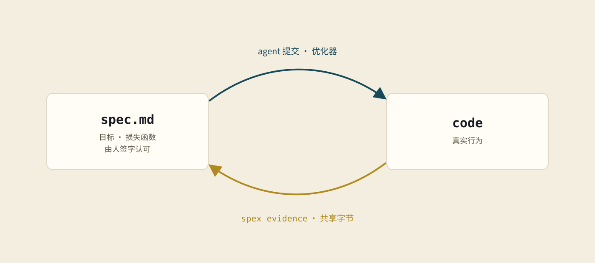
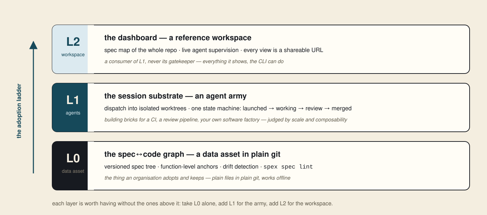
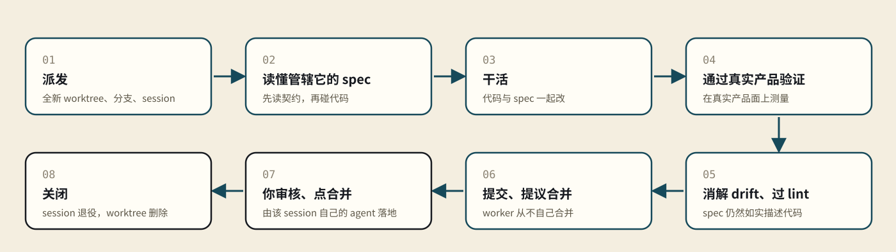
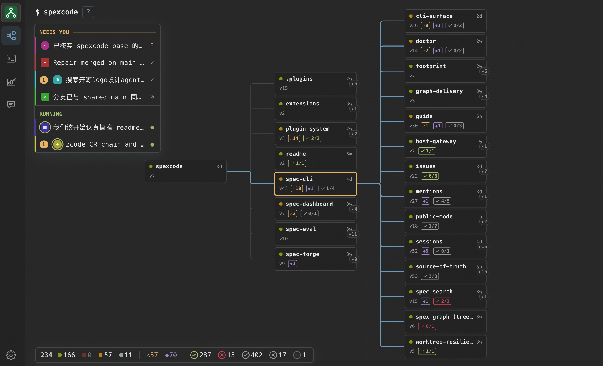
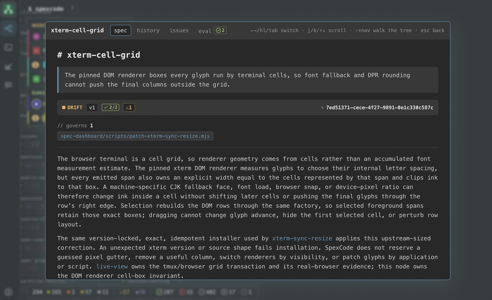
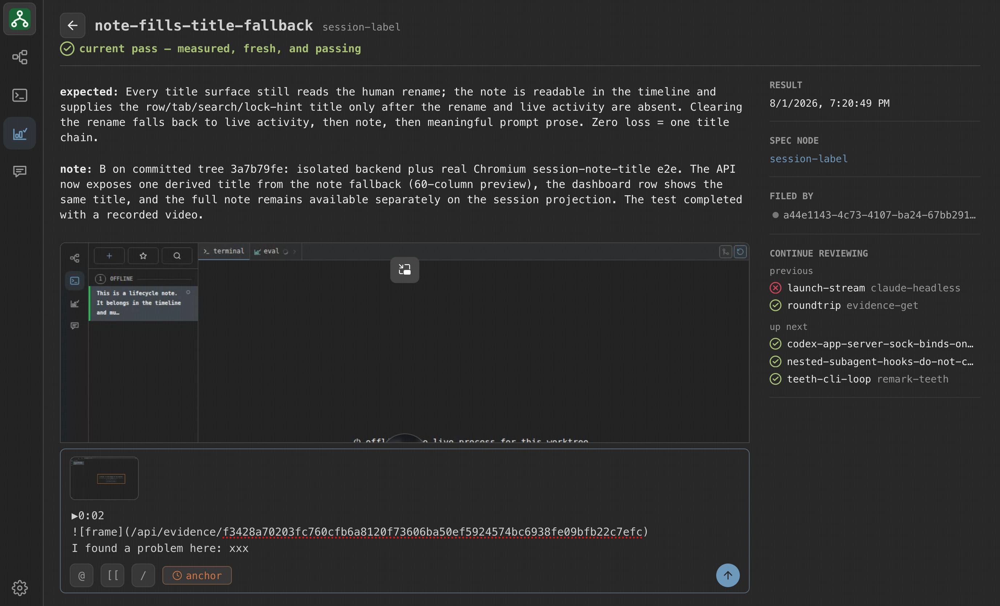

<div align="center">


<p>
  <a href="https://www.npmjs.com/package/spexcode"></a>
  
  
  <a href="https://spexcode.net"></a>
</p>

<p>
  
  
  
  
</p>

</div>

面向 coding agent 的 spec 驱动编排。SpexCode 在你的 git 仓库里维护一棵带版本的 spec 树,把每个
spec 和它管辖的代码链接起来,并运行一个会话管理器,把 coding agent 派进相互隔离的 worktree。你负责
review 和 merge,工具负责让意图和实现不漂移。

[English](../README.md) | 中文 · 文档:[spexcode.net](https://spexcode.net) · License: MIT

| 特性 | 说明 |
|---|---|
| **可计算的 spec–code drift** | 每个 spec 钉住它管辖的文件,可以细到函数。代码是否脱开 spec 单独动了,由 commit 和行区间算出来,在任何机器上结果一致:文件级是提醒,钉住的函数被改则直接阻断。 |
| **session 与 worktree 管理** | 每个任务在自己的 worktree 和分支里跑,互不相干的任务并行。session 有层级结构:一个 session 可以派发并监管自己的 worker,worker 之上有主管,主管之上还可以有主管。worker 只提议,你只在合并时 review 一次。 |
| **可分享的 URL** | spec 节点、session、eval、live 终端,dashboard 上每个视图都有稳定地址,发给同事就能看。两个人可以盯着同一块 session 看板。 |
| **模块化分层** | 三个可拆的层:spec↔code 数据资产(L0)、session 基座(L1)、dashboard(L2)。按需取用,L0 和 L1 就是为你自己的软件工厂准备的积木。 |
| **跨 harness 支持** | Claude Code、Codex、OpenCode、pi,交互式或 headless 都行。一份物化出来的工作流契约服务所有 harness,新增一个 harness 只是一条配置。 |

## 模型

一个 spec 节点就是 `.spec/` 下的一个目录,里面有一个 `spec.md`:frontmatter 写明它管辖的那一个文件
(`code:`,还可以用 `path#symbol` 钉到具体函数)和它引用的文件(`related:`),然后是一段正文,描述
系统这一部分当前应该做什么。节点可以嵌套,这棵树对应你对项目的理解方式,而不是文件布局。正文可以
分成两个部分:很短的 **raw source**,由人签字认可;**expanded spec** 是 agent 对这个意图的详细展开,
自由迭代,但必须始终和 raw source 一致。



git 是唯一的数据库:节点的版本就是碰过它 `spec.md` 的那些 commit。一次改动就是一个 commit,同时更新
spec 和它所解释的代码。代码要是单独动了,linter 会看见:



这个检查只比对 git 的朴素事实:spec 上一版之后来了哪些 commit,有没有碰到锚定单元的行区间。它判断
不了新行为是好是坏,只能判断 spec 已经描述不了代码。图里那个 commit 在同一次重命名里更新了另外七个
spec,漏掉了这一个。这类遗漏是正常工作的一部分,机械检查恰好逮得住。

## 把软件当学习系统

spec、commit、eval 组成一个优化循环。spec 是损失函数:写下你要什么,也是由人签字的那一半。commit 是
优化器。**eval** 是测量子系统,给当前真实行为离 spec 有多远打分:agent 在产品的真实表面上跑每个
场景,像真实用户那样操作,连证据(截图、录屏)一起归档。分数的历史和其它一切一样存在 git 里。修
bug 要求成对:先归档一条复现 bug 的失败 eval,修好后在同一场景归档一条通过的。

<div align="center"></div>

没有人靠盯着权重读神经网络,在两次合并闸门之间,你也不用盯着 agent 的 diff。注意力放在 spec 和
eval 这两端,diff 只在合并时读一次。

## 快速开始

需要 Node ≥ 22 和 git,这一步还不涉及 agent。

```sh
npm i -g spexcode                              # 安装 `spex` 命令
cd your-repo
spex init --harness claude,codex,opencode,pi,claude-headless,opencode-headless,pi-headless,codex-headless   # 播种 .spec/、装 git 钩子、物化 agent 契约
```

采纳到此为止。示例列出了全部内建 harness,不用的删掉就行,`--harness` 必填,接受任意一个 id 或
逗号分隔的子集。`spex init` 是增量的:在任何现有 git 仓库上都能跑,绝不覆盖你的文件,只做三件事。
它播种根节点 `.spec/project/spec.md` 和一份起步的 `spexcode.json`,安装 git 钩子,再把工作流规则
**物化**进你的 agent 本来就会读的文件(`CLAUDE.md`、`AGENTS.md`):动代码之前先读管辖它的 spec,spec 和
代码一个 commit 落地,只提议合并不执行合并。任何打开这个仓库的 agent 都会自己发现这套工作流。

想要活的看板(图谱、session、eval)再起运行时:

```sh
spex serve       # 本项目的后端,打印它的 URL
spex dashboard   # 本机唯一的 gateway,所有项目共用一个 URL
```

一台机器起一个 `spex dashboard` 就够了:所有在跑的项目都会出现在它下面,`/projects` 页面直接在
浏览器里管理它们。剩下的步骤见 [Getting started](https://spexcode.net/getting-started/)。

## 系统是怎么搭的

三层堆叠,每一层在没有上层的情况下都独立成立:



L0 是组织采纳后长期持有的资产:纯文件、纯 git,离线可用。
([看这个仓库自己的 L0 从 git 历史里长出来](https://spexcode.net/assets/spec-tree-growth.mp4),
三周 160 个 spec 节点。)L1 让 agent 在这份资产上干活,就是下面这台 session 状态机。L2 是你旁观
这一切的工作台,它只是 L1 的消费者,dashboard 能做的任何事,你的脚本和 agent 走同一套 CLI 都能做。

## 和 agent 一起工作(L1)

这一步需要机器上有 tmux,和登录好的 [Claude Code](https://www.anthropic.com/claude-code) 或
Codex(Windows 上请在 WSL2 里跑)。

```sh
spex session new "[[uploader]] 失败的分块要带退避地重传"
```

会在独立 worktree、分支 `node/uploader-…` 上启动一个 worker 会话。prompt 里第一个 `[[uploader]]`
提及决定分支名和看板归属;worker 会先找到管辖那段代码的 spec,读完才动手。它完成修改,把 spec 正文改写到
与代码一致,把两者一起 commit,然后提议合并、停下:



worker 从不自己合并。合并留在你手里:你点下去时,由那个 session 自己的 agent 执行真正的
`git merge`,冲突落在最了解这份工作的人身上。同样的派发在 dashboard 上是一个按钮,命令形式则是
agent 们自己委派任务时用的。两边都能监工:

```sh
spex session ls                  # 下面这张活表
spex session watch stream        # 跟踪状态流转:working → review → done …
spex session review uploader     # 领先主干的 commit、merge-base diff、合并/lint 闸门
spex session merge uploader      # 把带闸门的合并交给该 session 自己的 agent
spex session close uploader      # 退役 worktree、分支和记录
```



流程靠机制保证:后端建分支,git 钩子盖归属,pre-commit 守卫拦下直接落主干的 commit,物化进
`CLAUDE.md`/`AGENTS.md` 的工作流规则承担其余,你的派发 prompt 只需要写任务本身。这种工作方式的
更多内容:[working with agents](https://spexcode.net/working-with-agents/)。

## dashboard(L2)

上面的一切都有活的界面。起 `spex serve` 和 `spex dashboard`,然后:



*整个仓库一张地图,图中是 SpexCode 自己的看板。每个节点带着它的版本号和 eval 状态,正在被编辑的
节点上悬浮着那个 agent 的头像,左上角是活的 session 栏。*



*点开一个节点:上面是 raw source,下面是 expanded spec,还有它管辖的文件、当前的 drift 状态,以及
git 本来就记着的版本历史、issue、eval 各自的 tab。*



*一条正在审阅的 eval:判定、场景的期望结果、agent 的说明和录屏证据。可以直接在上面批注,右侧是
接着往下走的待审队列。*

整个工作台走 HTTP,所以每个视图,不论 spec 节点、session、eval 还是 live 终端,都是稳定 URL,发给
同事就能一起坐在同一块看板前。终端面板是真 tmux 会话,复制它打印的命令,就能从你自己的终端 attach
上去。

## 参与贡献

[`docs/CONTRIBUTING.md`](CONTRIBUTING.md) 带你从 clone 走到第一个被合并的改动。
[spexcode.net](https://spexcode.net) 有节点模型和反身插件系统的完整机制。

## 致谢

最早发布在 [LINUX DO](https://linux.do) 社区,感谢那里的第一轮讨论。

## License

[MIT](../LICENSE)。
